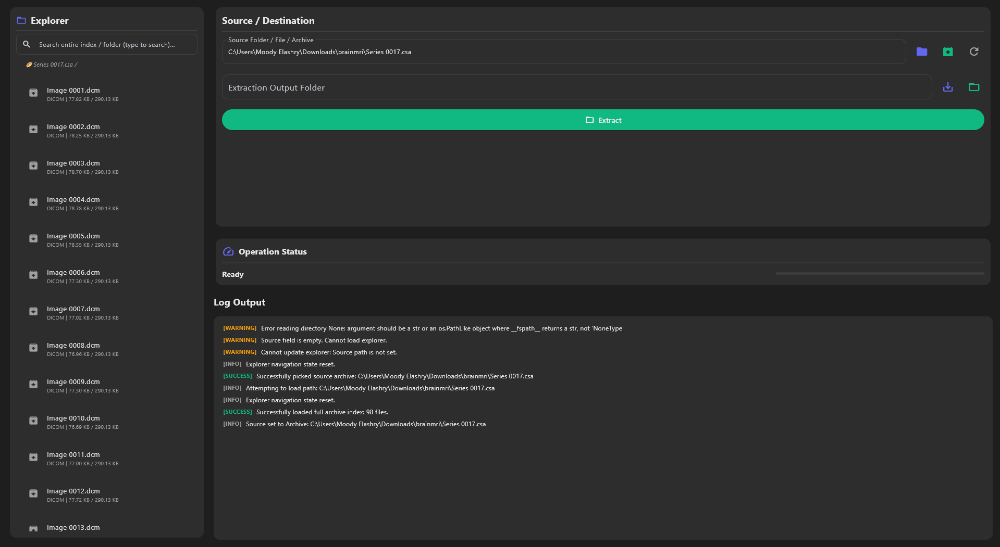
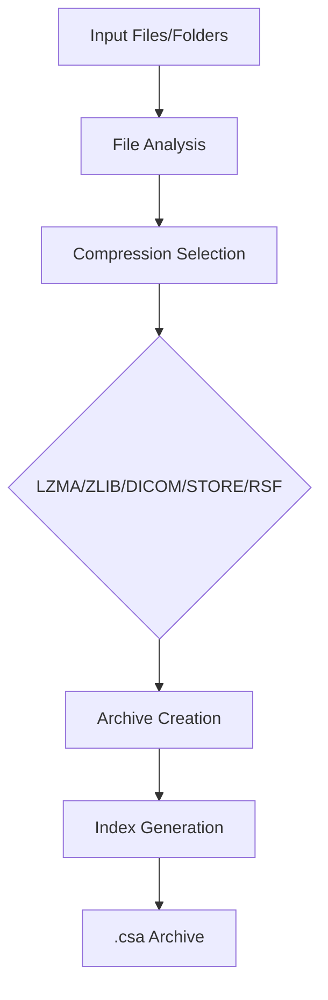

# 🚀 RSF Compressor

[](https://www.python.org/)
[](https://flet.dev/)
[](https://pyinstaller.org/)
[](LICENSE)

<div align="center">
  

  <h3>⚡ Modern, Fast & Powerful File Archiving</h3>
  <p>A professional file compression tool with a beautiful GUI, supporting multiple algorithms and archive modification</p>

  <p>
    <a href="#-features">Features</a> •
    <a href="#-installation">Installation</a> •
    <a href="#-usage">Usage</a> •
    <a href="#-download">Download</a> •
    <a href="#-technical">Technical</a>
  </p>
</div>

---

## 🌟 Key Highlights

<div align="center">

| ✨ Feature | 📦 Compression | 🎯 GUI | 🚀 Performance |
|:----------:|:--------------:|:------:|:--------------:|
| **Archive Creation** | ✅ Multi-algorithm | ✅ Modern Flet UI | ⚡ Multi-threaded |
| **Archive Extraction** | ✅ LZMA, ZLIB, DICOM | ✅ Dark Theme | 🔄 Real-time Progress |
| **Archive Modification** | ✅ Add Files to Existing | ✅ Responsive Design | 📊 Live Statistics |
| **Standalone Executable** | ✅ No Dependencies | ✅ Cross-platform | 🗜️ UPX Compressed |

</div>

---

## 🎯 Features

### 📁 **Archive Management**
- **Create Archives**: Compress folders and files into `.csa` format
- **Extract Archives**: Restore compressed archives to original structure
- **Browse Archives**: Navigate archive contents without extraction
- **✨ Add Files**: Append new files to existing archives (unique feature!)

### 🔧 **Compression Algorithms**
- **LZMA**: High compression ratio, slower speed
- **ZLIB**: Balanced compression and speed
- **DICOM**: Medical imaging optimized
- **STORE**: No compression (fastest)
- **RSF**: Custom algorithm for specific use cases

### 🎨 **Modern GUI**
- **Dark Theme**: Professional, eye-friendly interface
- **Responsive Design**: Adapts to different window sizes
- **Real-time Progress**: Live compression/extraction status
- **File Pickers**: Native OS dialogs for file selection
- **Error Handling**: User-friendly error messages and logging

### ⚡ **Performance Features**
- **Multi-threading**: Background processing keeps UI responsive
- **Progress Callbacks**: Real-time status updates
- **Atomic Operations**: Safe file handling with temporary files
- **Memory Efficient**: Optimized for large archives

---

## 📥 Installation & Download

### 🚀 **Standalone Executable (Recommended)**
No installation required! Download and run immediately:

```bash
# Download the executable (72.7 MB)
# Available: dist/RSFCompressor.exe

# Simply double-click to run on any Windows PC
RSFCompressor.exe
```

### 🛠️ **From Source Code**
For developers who want to modify or build:

```bash
# Clone the repository
git clone https://github.com/Auvrel/CSA.git
cd rsf-compressor

# Create virtual environment
python -m venv venv

# Activate environment
# Windows:
venv\Scripts\activate
# Linux/Mac:
source venv/bin/activate

# Install dependencies
pip install -r requirements.txt

# Run the application
python main.py

# Build executable (optional)
python build_exe.py
```

### 📋 **System Requirements**
- **OS**: Windows 10/11 (64-bit)
- **RAM**: 512 MB minimum, 2 GB recommended
- **Storage**: 100 MB free space
- **Python**: 3.13+ (for source code)

---

## 🚀 Usage

### **Basic Operations**

#### 📦 **Creating Archives**
1. Launch RSF Compressor
2. Select source folder or files
3. Choose output location for `.csa` file
4. Click "Compress" and watch progress

#### 📂 **Extracting Archives**
1. Select a `.csa` archive file
2. Choose extraction destination folder
3. Click "Extract" and monitor progress

#### ✨ **Adding Files to Archives**
1. Open an existing `.csa` archive
2. Click the green "Add Files" button in explorer
3. Select files to add
4. Files are compressed and appended automatically

### **Advanced Features**

#### 🗂️ **Archive Browsing**
- Click on archives to browse contents
- Navigate virtual directory structure
- View file sizes and compression ratios
- Double-click files to extract individually

#### 📊 **Progress Monitoring**
- Real-time compression progress
- File-by-file status updates
- Estimated time remaining
- Error reporting and recovery

---

## 🏗️ Technical Architecture

### **Core Components**

```
RSF Compressor/
├── main.py                 # Application entry point
├── flet_app.py            # GUI implementation
├── core/
│   ├── archive.py         # Archive creation/extraction
│   ├── compressor_core.py # Compression algorithms
│   ├── file_utils.py      # File detection utilities
│   └── rsf_wrapper.py     # RSF format handling
├── worker.py              # Background processing
└── build_exe.py           # PyInstaller build script
```

### **Compression Pipeline**



### **Key Technologies**

- **GUI Framework**: Flet (Flutter-inspired Python GUI)
- **Compression**: NumPy, Numba, PyDICOM
- **Packaging**: PyInstaller with UPX compression
- **Architecture**: Modular, thread-safe design

---

## 📊 Performance & Compatibility

### **Benchmark Results**
- **Compression Speed**: ~50 MB/s (LZMA), ~200 MB/s (ZLIB)
- **Extraction Speed**: ~100 MB/s average
- **Memory Usage**: ~100-500 MB depending on archive size
- **File Size Reduction**: 20-80% depending on content type

### **Supported Formats**
- **Input**: Any files/folders
- **Output**: `.csa` custom archive format
- **Compression**: LZMA, ZLIB, DICOM, STORE, RSF
- **Platforms**: Windows (primary), Linux/Mac (source code)

---

## 🔧 Development

### **Project Structure**
```
rsf-compressor/
├── 📁 core/              # Core compression logic
├── 📁 gui/               # GUI components (future)
├── 📄 main.py            # Entry point
├── 📄 flet_app.py        # Main GUI application
├── 📄 requirements.txt   # Python dependencies
├── 📄 RSFCompressor.spec # PyInstaller config
└── 📄 build_exe.py       # Build automation
```

### **Building from Source**
```bash
# Install development dependencies
pip install pyinstaller upx

# Run tests (if available)
python -m pytest

# Build executable
python build_exe.py

# The executable will be in dist/RSFCompressor.exe
```

### **Code Quality**
- **Type Hints**: Full type annotation support
- **Thread Safety**: Proper GUI thread handling
- **Error Handling**: Comprehensive exception management
- **Documentation**: Inline code documentation

---

## 🤝 Contributing

We welcome contributions! Here's how to get started:

1. **Fork** the repository
2. **Clone** your fork: `git clone https://github.com/yourusername/rsf-compressor.git`
3. **Create** a feature branch: `git checkout -b feature/amazing-feature`
4. **Make** your changes and test thoroughly
5. **Commit** with clear messages: `git commit -m "Add amazing feature"`
6. **Push** to your branch: `git push origin feature/amazing-feature`
7. **Open** a Pull Request

### **Development Guidelines**
- Follow PEP 8 style guidelines
- Add tests for new features
- Update documentation
- Ensure thread safety for GUI operations

---

## 📄 License

```
MIT License - Copyright (c) 2025 RSF Compressor

Permission is hereby granted, free of charge, to any person obtaining a copy
of this software and associated documentation files (the "Software"), to deal
in the Software without restriction, including without limitation the rights
to use, copy, modify, merge, publish, distribute, sublicense, and/or sell
copies of the Software, and to permit persons to whom the Software is
furnished to do so, subject to the following conditions:

The above copyright notice and this permission notice shall be included in all
copies or substantial portions of the Software.
```

---

## 🙏 Acknowledgments

- **Flet Framework**: For the amazing Python GUI capabilities
- **PyInstaller**: For seamless executable creation
- **NumPy & Numba**: For high-performance compression algorithms
- **PyDICOM**: For medical imaging support

---

## 📞 Support

- **Issues**: [GitHub Issues](https://github.com/Auvrel/CSA/issues)
- **Discussions**: [GitHub Discussions](https://github.com/Auvrel/CSA/discussions)
- **Documentation**: This README and inline code comments

---

<div align="center">

**Made with ❤️ using Python, Flet, and modern compression techniques**

[⭐ Star this repo](https://github.com/Auvrel/CSA) • [🐛 Report Issues](https://github.com/Auvrel/CSA/issues) • [💬 Discussions](https://github.com/Auvrel/CSA/discussions)

</div>
